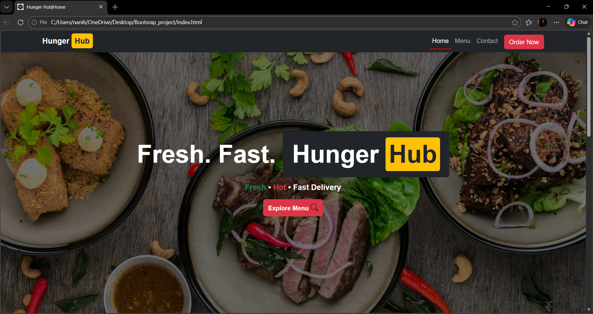
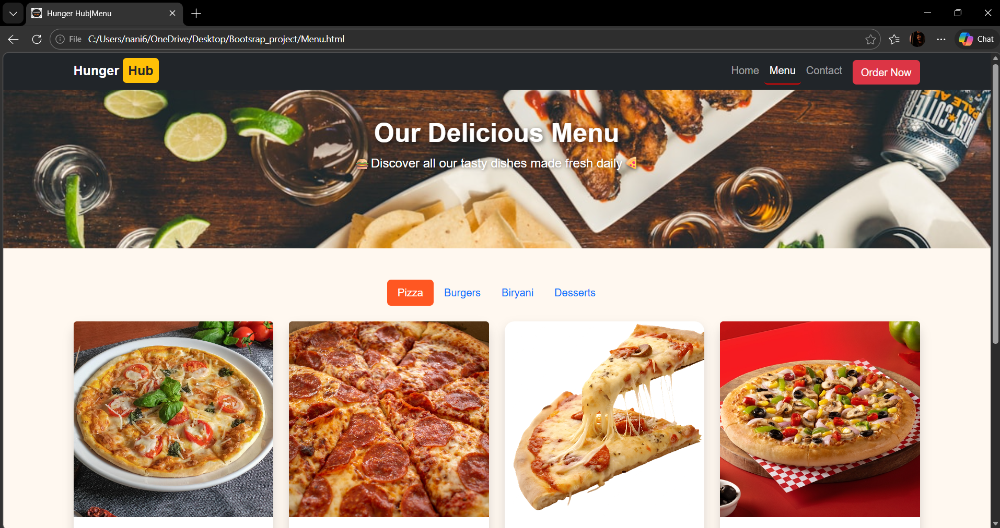
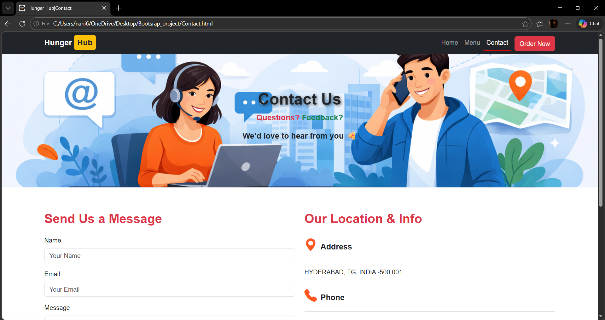

# 🍔 Hunger Hub – Restaurant Website

A responsive restaurant website built using **HTML, CSS, Bootstrap, and JavaScript**.
The website displays different food categories like pizzas, burgers, biryanis, desserts, drinks, and ice creams.

## 🚀 Features

* Responsive design using Bootstrap
* Food categories with tab navigation
* Interactive menu page
* Attractive food cards with images
* Order buttons for each item
* Modern UI with Bootstrap components

## 🛠 Technologies Used

* HTML5
* CSS3
* Bootstrap 5
* JavaScript

## 📂 Pages

* Home Page
* Menu Page
* Contact Page

## 🍕 Menu Categories

* Pizzas
* Burgers
* Biryanis
* desserts-->
      * Cakes
      * Ice Creams
      * Drinks / Mocktails

## 💻 How to Run the Project

1. Download or clone the repository.
2. Open `index.html` in your browser.
3. Navigate rest of the pages using navigation bar.

## 👨‍💻 Author

Developed by **Venkatesh Gunturi**
